# Liferay Workflow Extensions

A collection of Liferay Workflow Action Executor examples.

The base package for these modules is com.liferay.workflow and this can be used when configuring loggers, if required.

## Use Case Example

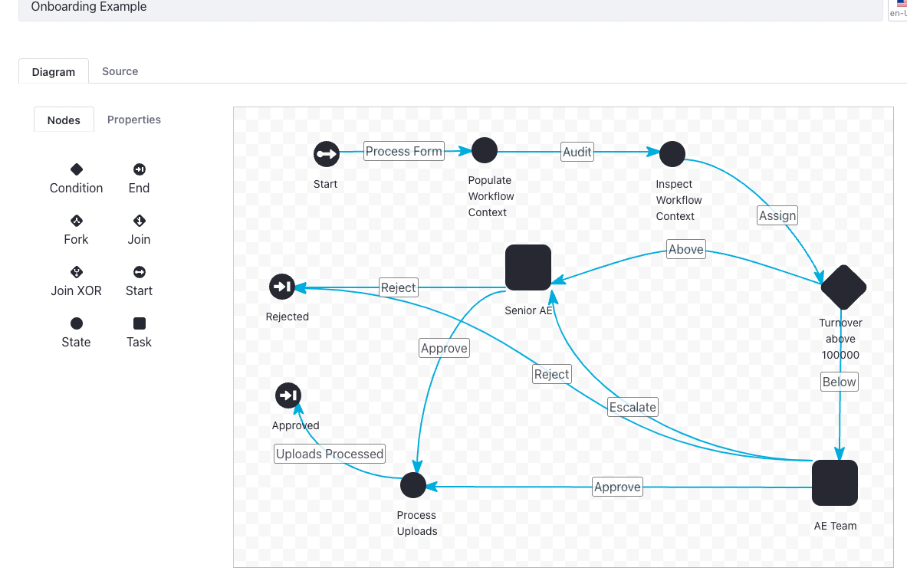

[Download Workflow](example/onboarding.xml "download")

### Form Definition

There are two custom fields which are key to this example, Company Name and Annual Turnover. The former is used when creating the folder for the document uploads and the latter is used by a conditional node (Groovy script) to determine which of the Sales team will work on the prospect.

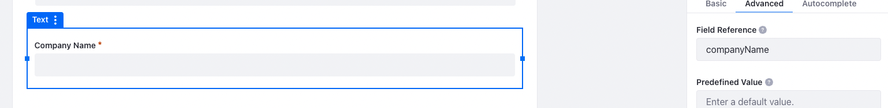

### Workflow Definition

This is the Groovy script which uses the Annual Turnover. The value of this variable was extracted from the form.

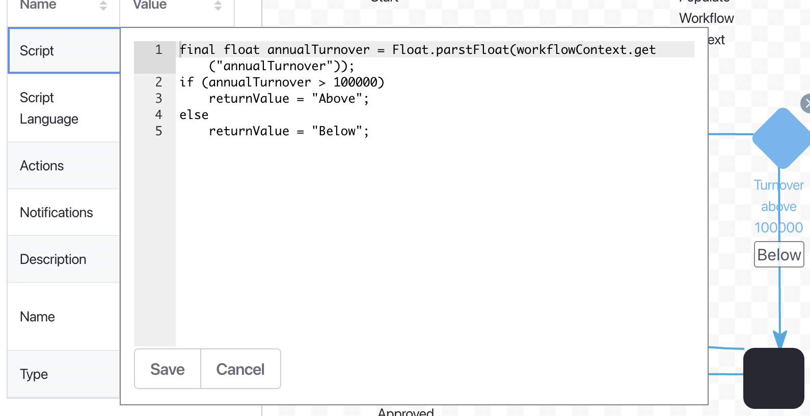]

The notification template uses all the fields extracted from the form to construct the notification and emails. As the variables have been added to the workflowContext then they can be used like any other field available to the Freemarker template. 

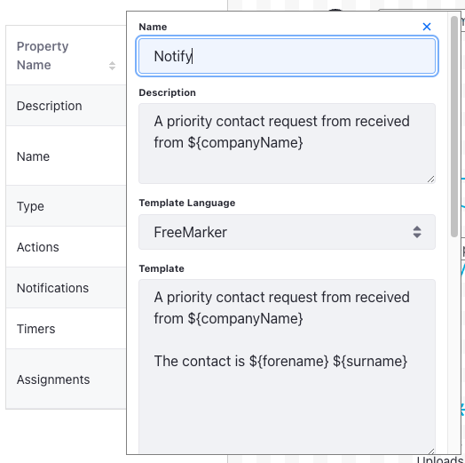

### Prospect above 100,000

The following shows the example of the use case where the annual turnover is above 1000,000

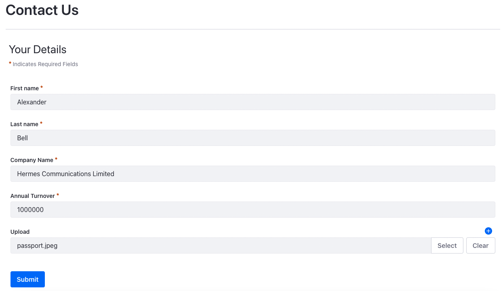

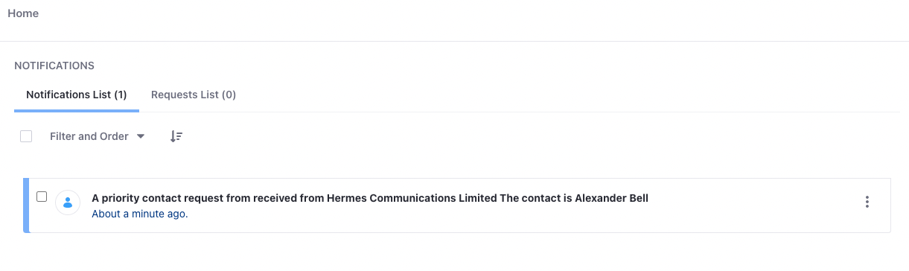

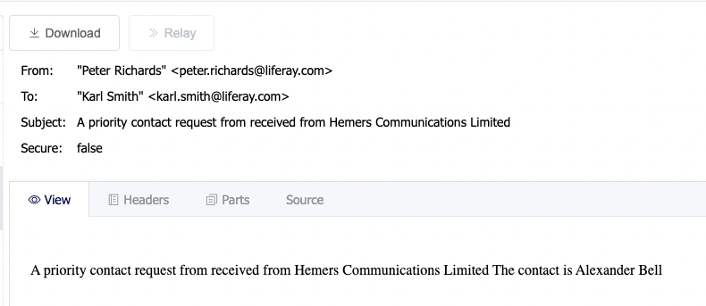

The following shows how the Company Name was used to create the folders and the fact the DDM Form Upload Processor has moved the appropriate document into the relevant folder. 

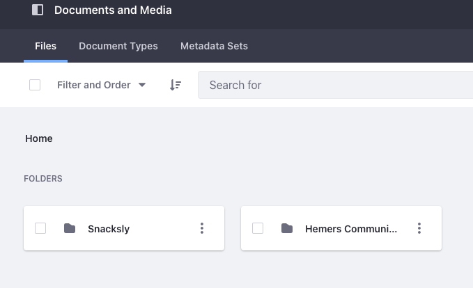

### Prospect below 100,000

The following shows the example of the use case where the annual turnover is below 1000,000

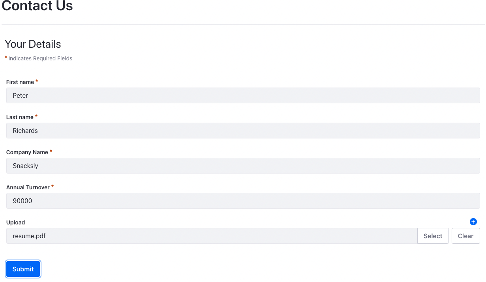

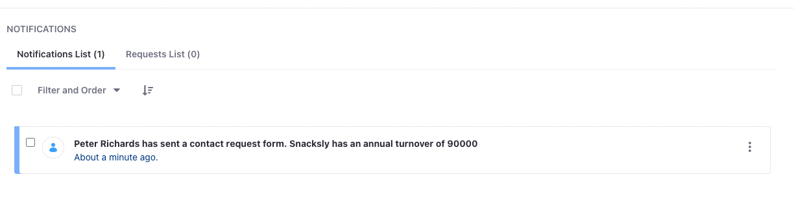

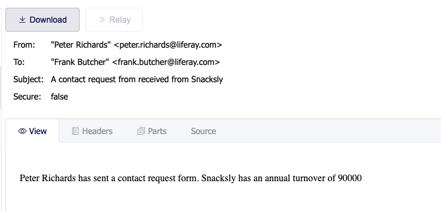

## Workflow Extensions Common

This module provides common functionality required by the majority the other modules.

Please look at the description of each module below to understand if this is a dependency of not.

## Workflow Context Inspector

A very simply but useful module which outputs the content of the Liferay workflowContext to the logs.

## Dynamic Data Mapping Form Extractor

This module will extract the configured form fields (by field reference) from the Liferay form

It also supports custom fields introduced by the user-data modules, as a separate configurable JSON map.

These fields can then be used in notifications, email templates and other workflow steps.

The module can be configured on a per form instance basis.

### Dependencies

This module is dependent on the Workflow Extensions Common module.

## Dynamic Data Mapping Upload Processor

This module moves the upload documents into a configurable user specific folder.

The folder to which the uploads are moved can be named either using workflow context values or user attributes, such as
their screen name.

The module can be configured on a per form instance basis.

### Dependencies

This module is dependent on the Workflow Extensions Common and Dynamic Data Mapping Form Extractor modules.