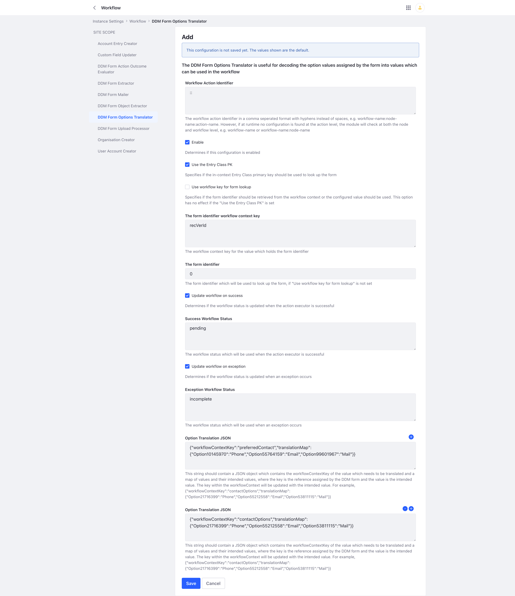
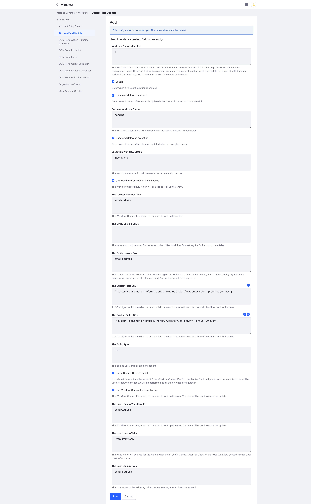

# Liferay Workflow Extensions

A collection of Liferay Workflow Action Executor examples.

The base package for these modules is com.liferay.workflow and this can be used when configuring loggers, if required.

[Use case example](example/README.md)

## Workflow Extensions Common

This module provides common functionality required by the majority the other modules.

Please look at the description of each module below to understand if this is a dependency of not.

## Workflow Context Inspector

A very simply but useful module which outputs the content of the Liferay workflowContext to the logs.

## Dynamic Data Mapping Form Extractor

This module will extract the configured form fields (by field reference) from the Liferay form

It also supports custom fields introduced by the user-data modules, as a separate configurable JSON map.

These fields can then be used in notifications, email templates and other workflow steps.

The module can be configured on a per form instance basis.

### Dependencies

This module is dependent on the Workflow Extensions Common module.

## Dynamic Data Mapping Upload Processor

This module moves the upload documents into a configurable user specific folder.

The folder to which the uploads are moved can be named either using workflow context values or user attributes, such as
their screen name.

The module can be configured on a per form instance basis.

### Dependencies

This module is dependent on the Workflow Extensions Common and Dynamic Data Mapping Form Extractor modules.

## Dynamic Data Mapping Form Action Outcome Evaluator

This module is used to check the outcome of a previous step, i.e. the workflow status. The workflow status
can then be used to follow different flows (transitions) depending on the configured statuses and transition names.

It currently only supports two transitions, i.e. success or failure and the configuration applies at a form level,
so typically this would mean all Evaluators within a single workflow will use the same configuration.

The module can be configured on a per form instance basis.

### Dependencies

This module is dependent on the Workflow Extensions Common module.

## Dynamic Data Mapping Form Options Translator

This module is used to convert or translate internal option references to their use case equivalent value.

It works with both single and multiple selection fields.

The module can be configured on a per form instance basis.

### Dependencies

This module is dependent on the Workflow Extensions Common module.

## Dynamic Data Mapping Form Mailer

This module is used to send emails to a central mailbox or anonymous user.

It supports templates for the email subject and body which can make use of values in the workflow context using ${...}
syntax.

The module can be configured on a per form instance basis.

### Dependencies

This module is dependent on the Workflow Extensions Common module.

## Custom Field Updater

This module is used to update one or more custom field on a user, account or organisation entity. A single instance can only update a single entity type but multiple instances can existing within a single workflow 

The custom updater needs a user context in which to perform the update. It can use the in-context user or a specific user can be looked up by email address, screen name or user id. The user lookup value can be stored in configuration or extracted from a workflow context key.

The entity can be looked up using different methods depending on the entity type. The lookup value can be stored in configuration or taken from the workflow context

The module can be configured on a per workflow:node:action basis.

### Dependencies

This module is dependent on the Workflow Extensions Common module.