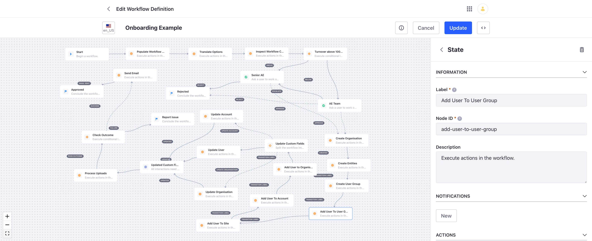
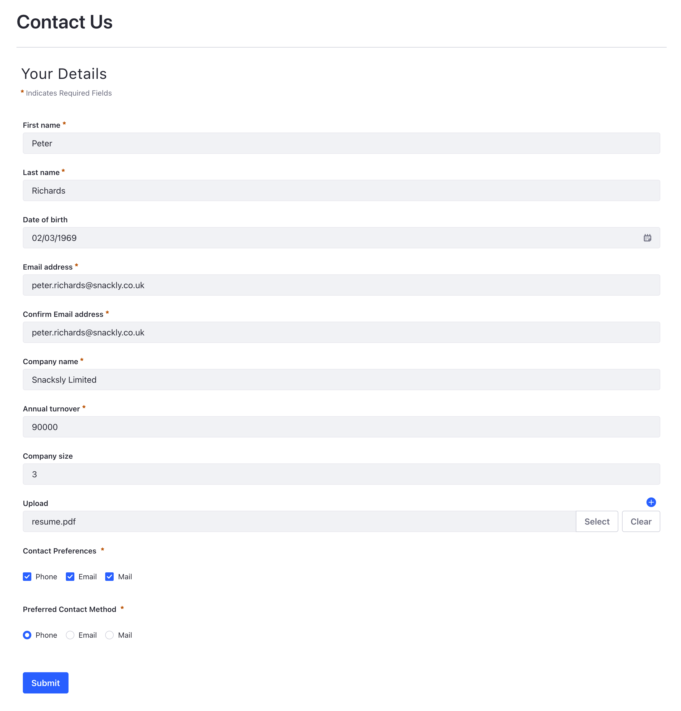

## Use Case Example

[Download Workflow](onboarding.xml "download")

### Form Definition

There are two custom fields which are key to this example, Company Name and Annual Turnover. The former is used when
creating the folder for the document uploads and the latter is used by a conditional node (Groovy script) to determine
which of the Sales team will work on the prospect.

### Workflow Definition

This is the Groovy script which uses the Annual Turnover. The value of this variable was extracted from the form.

]

The notification template uses all the fields extracted from the form to construct the notification and emails. As the
variables have been added to the workflowContext then they can be used like any other field available to the Freemarker
template.

### Checking the Process Uploads outcome

The Check Outcome condition node uses the DDM Form Action Outcome Evaluator to determine what action to take depending
on whether the uploads were processed successfully, i.e. approve the application or report the issue to an administrator.

### Prospect above 100,000

The following shows the example of the use case where the annual turnover is above 1000,000

The following shows how the Company Name was used to create the folders and the fact the DDM Form Upload Processor has
moved the appropriate document into the relevant folder.

### Prospect below 100,000

The following shows the example of the use case where the annual turnover is below 1000,000

